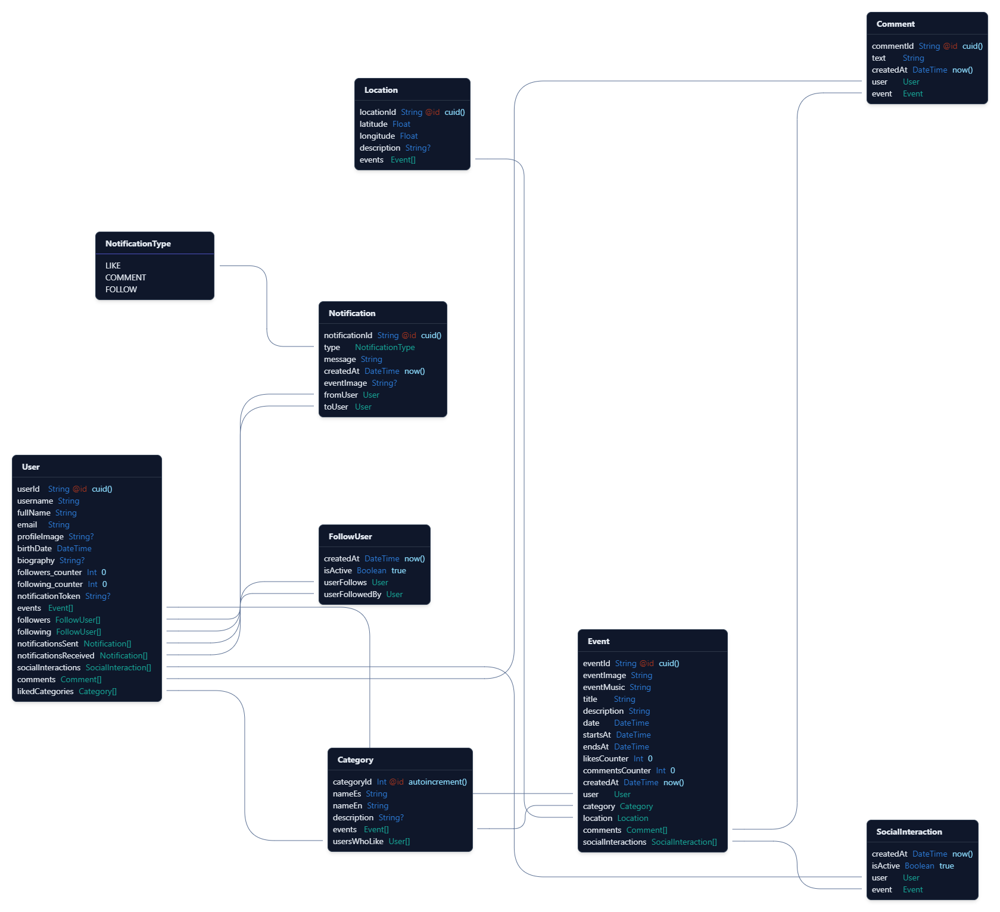

# Eventify API

## Description

Eventify API is the backend that powers the Eventify mobile platform, designed for event management and user interaction. This API provides all the necessary endpoints to support the application's essential functionalities, including event administration, user connection, and social features such as followers, notifications, and comments.

## Technologies Used

- **Node.js**: JavaScript runtime environment for the server side.
- **Express**: Web framework for Node.js that facilitates the creation of RESTful APIs.
- **Prisma**: ORM (Object-Relational Mapping) for interacting with the database.
- **PostgreSQL**: Relational database management system.
- **Supabase**: Backend-as-a-Service (BaaS) platform for authentication and storage.
- **TypeScript**: Programming language that adds static typing to JavaScript.
- **Zod**: Library for schema validation.
- **Faker.js**: Library for generating realistic test data.

## Project Structure

```
api/
├── db/
│   ├── prisma/
│   │   ├── migrations/      # Database migrations
│   │   └── schema.prisma    # Database schema
│   ├── seeder.ts            # Script to populate the database with test data
│   └── clearDatabase.ts     # Script to clear the database
├── server.js                # Application entry point and endpoint definition
├── validationSchemas.js     # Validation schemas for input data
├── authenticateUser.js      # Authentication middleware
├── .env                     # Environment variables (not included in the repository)
├── .env.example             # Example environment variables
├── package.json             # Dependencies and scripts
└── README.md                # Project documentation
```

## Data Models

The API manages the following main models:

- **User**: Platform users with profile information.
- **Event**: Events created by users with details such as title, description, date, etc.
- **Category**: Categories to classify events (Parties, Concerts, Sports, etc.).
- **Location**: Geographic locations of the events.
- **Comment**: User comments on the events.
- **SocialInteraction**: Social interactions such as "likes" on events.
- **FollowUser**: Follow relationships between users.
- **Notification**: Notifications for users about platform activities.

### Entity-Relationship Diagram

Below is the Entity-Relationship Diagram (ERD) of the database:



## Prerequisites

- Node.js (v18 o or higher)
- npm or yarn
- PostgreSQL
- Supabase account

## Environment Setup

1. Clone the Repository:
   ```bash
   git clone https://github.com/ruggieroDaniela/eventify-api.git
   cd eventify-api
   ```

2. Install Dependencies:
   ```bash
   npm install
   # or
   yarn install
   ```

3. Configure Environment Variables:
   - Create a `.env` file in the project root, based on `.env.example`
   - Add the following variables:
     ```
     SUPABASE_URL=your_supabase_url
     SUPABASE_ANON_KEY=your_supabase_anon_key
     DATABASE_URL=your_database_url
     DIRECT_URL=your_direct_database_url
     ```

4. Set up the Database:
   ```bash
   npm run db:push
   # or
   yarn db:push
   ```

5. (Optional) Seed the Database with Test Data:
   ```bash
   npm run db:seed
   # or
   yarn db:seed
   ```

## API Execution

### Development

To start the API in development mode:

```bash
npm run start:dev
# or
yarn start:dev
```

### Production

To start the API in production mode:

```bash
npm start
# or
yarn start
```

## Main Endpoints

The API provides the following main endpoints:

### Authentication
- Authentication is handled via Supabase Auth with JWT (JSON Web Token) tokens.

### Users
- `GET /api/users/:userId` - Get user details
- `PUT /api/users/:userId` - Update user profile
- `GET /api/users/:userId/followers` - Get a user's followers
- `GET /api/users/:userId/following` - Get users followed by a user
- `POST /api/users/:userId/follow` - Follow a user
- `DELETE /api/users/:userId/follow` - Unfollow a user
- `GET /api/users/search` - Search for users

### Events
- `GET /api/events` - Get a list of events
- `POST /api/events` - Create a new event
- `GET /api/events/:eventId/:userId` - Get details of an event
- `PUT /api/events/:eventId` - Update an event
- `DELETE /api/events/:eventId` - Delete an event
- `GET /api/events/search` - Search for events
- `GET /api/events/user/:userId` - Get a user's events

### Social Interactions
- `POST /api/events/:eventId/like` - Like an event
- `DELETE /api/events/:eventId/like` - Unlike an event
- `POST /api/events/:eventId/comment` - Comment on an event
- `GET /api/events/:eventId/comments` - Get comments for an event

### Notifications
- `GET /api/notifications/:userId` - Get a user's notifications

### Categories
- `GET /api/categories` - Get all categories

### Locations
- `POST /api/locations` - Create a new location
- `DELETE /api/locations/:locationId` - Delete a location

## Development Tools

- **Prisma Studio**: Visual interface for database exploration and modification.
  ```bash
  npm run db:studio
  # or
  yarn db:studio
  ```